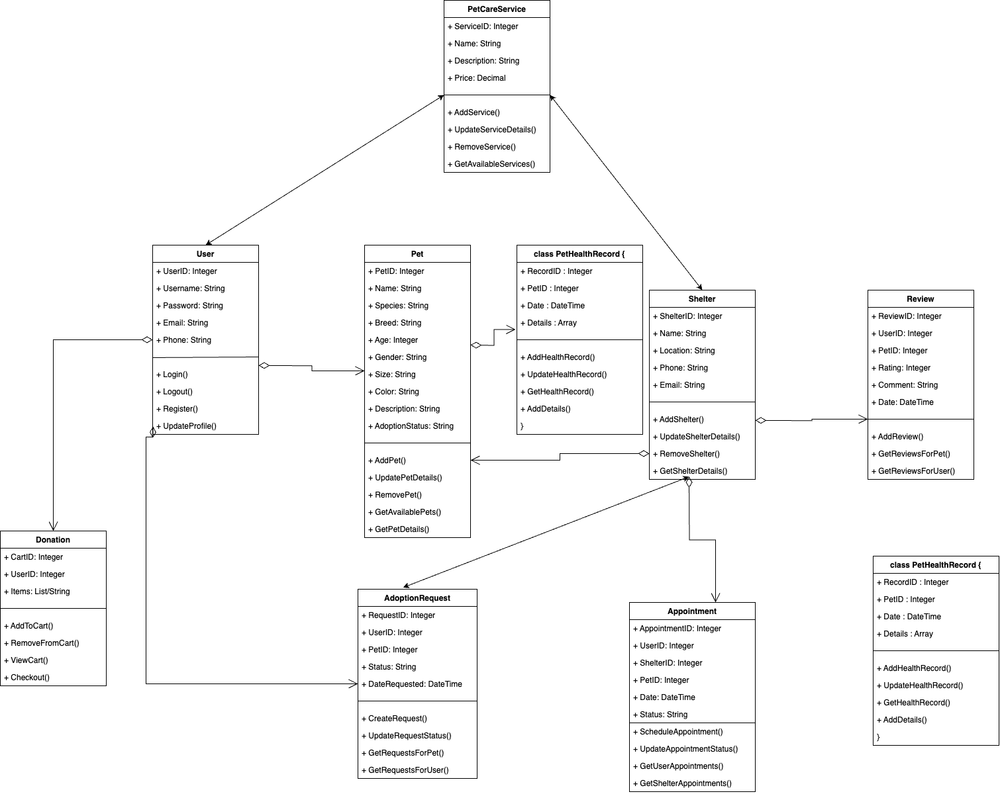
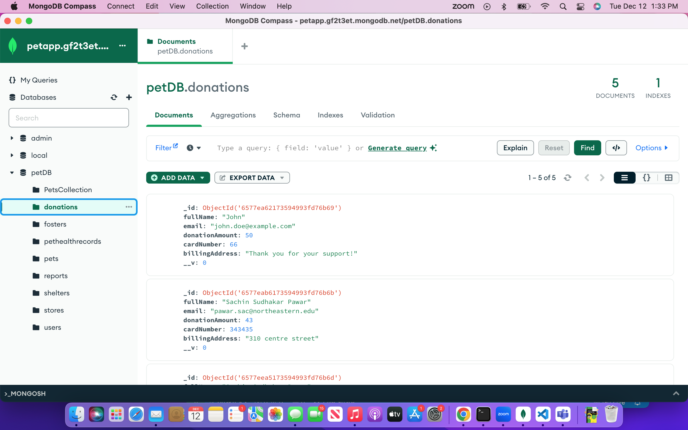

# PETICURE - Pet Adoption & Support Platform

## Overview

PETICURE is a comprehensive pet adoption and support platform designed to connect pet enthusiasts with their ideal companions and contribute to the welfare of pets in need. Beyond adoption services, our platform integrates features for facilitating food and toy donations, allowing users to contribute to the well-being of pets awaiting their forever homes. 
The application allows a genuine system user to verify shelters, shelter owners and fosters. This provides a safe network for all pet parents and associations to be able to establish trust and confirm pet safety.

## Features

- **Pet Adoption:** Browse through a diverse range of adoptable pets with detailed profiles.
- **Donation:** Contribute to the platform's ongoing donation Page.
- **Local Fosters:** Find and connect with local foster homes for pets in need.
- **Verified Shelters and Foster Homes:** Verify Shelters and shelter owners
- **Reviews** genuine reviews by system users for fosters, shelters and shelter owners
- **Google Maps Integration:** Locate nearby shelters,adoption centers,and foster homes easily using the functionality of maps


## Tech Stack

- **Frontend:** Developed using Next.js with a responsive and intuitive UI, styled with SCSS for a visually appealing experience.
- **Backend:** Utilizes Express.js to handle REST API requests and interactions with MongoDB for efficient data storage.
- **State Management:** Employs **Redux Toolkit** to manage the global state, ensuring seamless data flow between components.
- **Authorization:** JWT authorization ensures secure user authentication for a personalized experience.
- **PWA:** Enjoy a progressive web app experience, enabling offline functionality and fast load times.
- **Internationalization :** Peticure speaks your language! The UI is designed to cater to users from various linguistic backgrounds.
- **Google Maps API:** Seamlessly integrate location services to enhance user experience and navigation.
- **Stride Payment Integration:** Facilitate secure and convenient donations using the widely trusted PayPal platform.
- **Email Integration:** Email confirmations for adoption, shelter appointments etc

## Getting Started

### Object model:


## UI screenshot


## Backend screenshot



### Prerequisites

- [Node.js](https://nodejs.org/)
- [SwaggerUI](https://editor-next.swagger.io/)
- [ExpressJS](https://expressjs.com/)
- [Postman](https://www.postman.com/)
- [MongoDB Atlas](https://www.mongodb.com/atlas/database)
- [Redux toolkit](https://redux-toolkit.js.org/)
- [Next.js](https://nextjs.org/docs)
- [.env]


### Installation

#### Part 1
1. Clone the repository:

   ```bash
   git clone https://github.com/info-6150-fall-2023/final-project-peticure.git

#### Part 2

- **Run the Backend**

1. Navigate to backend directory :
   ```bash
   cd backend

2. Install the dependencies for backend :
   ```bash
   npm install

3. Run the backend using the following command :
   ```bash
   npm start

- **Run the Frontend**

1. Navigate to ui directory :
   ```bash
   cd ui

2. Install the dependencies for frontend :
   ```bash
   npm install

3. Run the backend using the following command :
   ```bash
   npm run dev

6. Paste URL in Search bar:
   ```bash
    localhost:3000/
